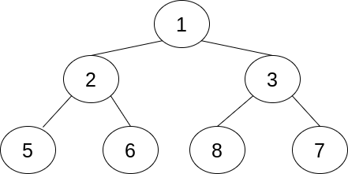

# Heap
Heaps are an implementation of a tree structure with a *heap property*. The heap property makes the tree ordered.

**Heap Property**: ensures a specific order of elements based on a comparison. This ensures that each node is ordered using this comparison.

In general, heaps are not meant to allow for the finding of anything but the smallest or largest element. Anything else would require something like a Binary Search Tree.

## Common Heaps
## Binary Tree Heap (Heap Tree)
Uses a binary tree structure and is a complete tree which means that all levels, except the last, are filled and the last level is filled from left to right without gaps.

In a heap tree, the parent node is always smaller than both of its children. Adding elements to a heap tree temporarily violate the heap property; a new element is first pushed into the available node then the comparison between the new node and its parent push it up the tree, if necessary.

Min-heap
A type of binary tree heap. The value of the parent node in a min-heap is always less than or equal to the values of its children. The smallest value in the tree is the root.

Max-heap
A type of binary tree heap. The value of a parent node in a max-heap is always greater than or equal to the values of its children. The largest value in the tree is that root.

Big-O
Insertion: O(logN); insertion is at the next available element to satisfy completeness then the heap property is run over the tree to sort/ensure the proper order.
Deletion: O(logN)
Retrieve max/min value: O(1)

## `heapq`
[Real Python - heapq Module](https://realpython.com/python-heapq-module/)

`heapq` is a module in Python standard library that is implemented as a min-heap.

Because a heap tree is a *complete* binary tree, we know how many elements are at all levels of the tree except the last. Even if the last level of the tree is incomplete, they must be filled in from left-to-right order. Knowing this, a heap can be implemented as a List (which is what `heapq` does). The `heapq` module also implements heap operations *on* a list - it doesn't define a custom class.

Relationship of the element at index `k` and its surrounding elements:
- First child: `(2 * k) + 1`
- Second child: `(2 * k) + 2`
- Its parent: `(k - 1) // 2`

Useful methods:
- `heapify()` - turns a list into a heap
- `heappop()` - remove the first element in the heap
- `heappush()` - push a new element into the heap
