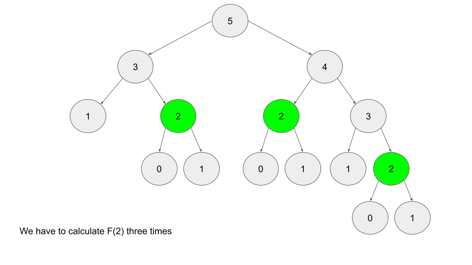

# Dynamic Programming (DP)
DP is a paradigm that explores all possible solutions to a problem in a systematic and efficient manner. There are two primary characteristics of problems that can be solved with DP:
1. The problem can be broken down into *overlapping* subproblems. These are smaller versions of the original problem that are re-used.
2. The problem has an *optimal substucture* meaning that the optimal solution is compromised of many overlapping subproblems of the original problem.

Fibonacci Sequence is a good example. The subproblem for F(n), n = 2, is `F(n - 1)` and `F(n - 2)`. The optimal substructure is `F(n-1) + F(n-2)`.

There are generally two ways to implement DP problems: top-down (memoization) and bottom-up (tabulation).

But how do you know when to use DP? It's hard to know, for sure, under pressure and time constraints. Generally, problems that can be solved with DP will have the following characteristics:
- The problem will ask for an optimum value or the number of ways to do something (e.g., what is the maximum cost, how many ways are there to do x, what is the longest possible)
- Future decisions in each step depend on earlier decisions (note: this factors greedy solutions out because they assume that the optimal choices are made from the beginning)

## Bottom-up (Tabulation)
Implemented with iteration and starts with a base case. It is usually faster because iteration doesn't have the overhead that recursion and memoization does.

For Fibonacci, we would iterate through, in order, the logical subproblems that are needed to get the answer. Starting with the base case, we iterate until we reach an endpoint.
```
F = array of length (n + 1)
F[0] = 0
F[1] = 1
for i from 2 to n:
    F[i] = F[i - 1] + F[i - 2]
```

The base case is `F[0] = 0` and `F[1] = 1`. We iterate with a `for` loop to get the answer.

## Top-down (Memoization)
Top-down is implemented with recursion, usually, and made efficient with memoization. This method is usually easier to write because, with recursion, the order of the subproblems does not matter. 

For Fibonacci, again, we would compute `F(n-1)` then `F(n-2)` and so on. This can be represented as a recursive pattern with will continue until we reach out base case, `F(0) = F(1) = 1`.



Because we have to calculate the same value multiple times, recursion can quickly become inefficient. This is where memoization comes into play: it allows us to save the results of a given input for reuse without the need to recalculate.

```
memo = hashmap
Function F(integer i):
    if i is 0 or 1: 
        return i
    if i doesn't exist in memo:
        memo[i] = F(i - 1) + F(i - 2)
    return memo[i]
```
